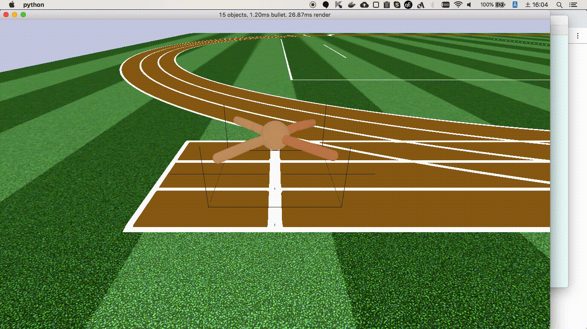

roboschool_chainerrl
===================

[ChainerRL](https://github.com/chainer/chainerrl) is powerful library for reinforcement learning.
[Roboschool](https://github.com/openai/roboschool) is also powerful simulation software for robot.

This repository is trying to train with ChainerRL and Roboschool.

Demo
----




How to Run
----------

On Docker instance (Using nvidia-docker2. You need GPU)

```
$ docker run --runtime=nvidia -it -p 6080:6080 ikeyasu/reinforcement-learning:latest
```

```
$ docker run --it -p 6080:6080 ikeyasu/reinforcement-learning:cpu
```

You can see screen on http://localhost:6080


### Training

```
$ python3 train.py --gpu 0 --steps=2000000 --minibatch-size=8 --env=RoboschoolAnt-v1
```

### Demo

```
$ python train.py --load=<Path to dir of model.npz> --render --demo --gpu=-1

```

`Path to dir of model.npz` is like "out/20180907T002102.478797/2000000_finish/".

License
======

```
MIT License

Copyright (c) 2018 ikeyasu.com

Permission is hereby granted, free of charge, to any person obtaining a copy
of this software and associated documentation files (the "Software"), to deal
in the Software without restriction, including without limitation the rights
to use, copy, modify, merge, publish, distribute, sublicense, and/or sell
copies of the Software, and to permit persons to whom the Software is
furnished to do so, subject to the following conditions:

The above copyright notice and this permission notice shall be included in all
copies or substantial portions of the Software.

THE SOFTWARE IS PROVIDED "AS IS", WITHOUT WARRANTY OF ANY KIND, EXPRESS OR
IMPLIED, INCLUDING BUT NOT LIMITED TO THE WARRANTIES OF MERCHANTABILITY,
FITNESS FOR A PARTICULAR PURPOSE AND NONINFRINGEMENT. IN NO EVENT SHALL THE
AUTHORS OR COPYRIGHT HOLDERS BE LIABLE FOR ANY CLAIM, DAMAGES OR OTHER
LIABILITY, WHETHER IN AN ACTION OF CONTRACT, TORT OR OTHERWISE, ARISING FROM,
OUT OF OR IN CONNECTION WITH THE SOFTWARE OR THE USE OR OTHER DEALINGS IN THE
SOFTWARE.
```

This work is derived from [MuJuCo models](http://www.mujoco.org/forum/index.php?resources/)
used under the following license:

```
This work is derived from MuJuCo models used under
the following license:

This file is part of MuJoCo.     
Copyright 2009-2015 Roboti LLC.	
Mujoco		:: Advanced physics simulation engine
Source		: www.roboti.us
Version		: 1.31
Released 	: 23Apr16
Author		:: Vikash Kumar
Contacts 	: kumar@roboti.us
```

This repository is based on and inspired by [ai-bs-summer17](https://github.com/uchibe/ai-bs-summer17/blob/ec7ecd921a0fdefba106cf11915b6e3e98324b3a/roboschool/train_ddpg_gym.py)
and [ChainerRL sample](https://github.com/chainer/chainerrl/blob/a30e5d413e4c6f8d2eb6e9c0a048ae2c498cc5cf/examples/gym/train_ddpg_gym.py)([ChainerRL license](https://github.com/chainer/chainerrl/blob/master/LICENSE)).
